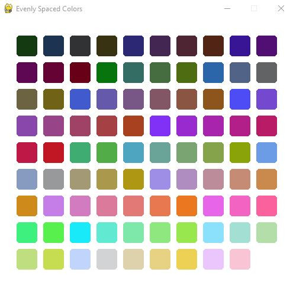

# Random Colors
This is a repository which combines a couple of my different projects relating to color.

## Color Gradient Paths
The first project I decided to work on can be found in para-color.py. This project was a little UI for selecting points in the <a href='https://en.wikipedia.org/wiki/RGB_color_model'>RGB color model</a> and
creating linear paths between them. Scrolling while hovering of the right most square of the UI moves the current view of the RGB color cube up the
blue-axis and clicking in this square selects a point. You can see the selected points in the square to the right. Once at least two points have been
selected, the program will automatically follow a piecewise linear path between all of the points, changing the background color to match the current
position of the marker following this path.

  
  <h5 align = 'center'>Example of piecewise linear gradient selection</h5>

Eventually, I hope to add some way to interface with an arduino to control a set of RGB lights using this tool.

## Distinguishable Color Generation
In a research group of mine (Texas Experimental Geometry Lab), my group ran across the issue of needing to distinctly color a large number of datapoints.
Randomly generating RGB values does not work well and neither does selecting a lattice of points in the RGB color model. This is because this model is not
perceptually uniform (euclidean distance does not equate to human perceptual difference). That is, colors could be relatively far in terms of their RGB 
coordinate, but still look similar to a human observer.

There are many <a href='https://en.wikipedia.org/wiki/Color_space'>color spaces</a> out there, but <a href='https://en.wikipedia.org/wiki/CIELAB_color_space'>CIELAB</a> is built with the intention of being highly perceptually uniform. Using the <a href='https://python-colormath.readthedocs.io/en/latest/'>colormath</a> library, we can selected points in this space which are along a lattice in CIELAB and therefore have a minimum guaranteed perceptual difference between them,

  
  <h5 align = 'center'>Intersection of lattice with CIELAB</h5>

Colors can be easily selected in batches in the even-colors.py file by changing the input of the get_grid_colors function. The behind the scenes work to get these colors can be seen in cielab.py.

  
  <h5 align = 'center'>Generated colors using the described procedure</h5>

